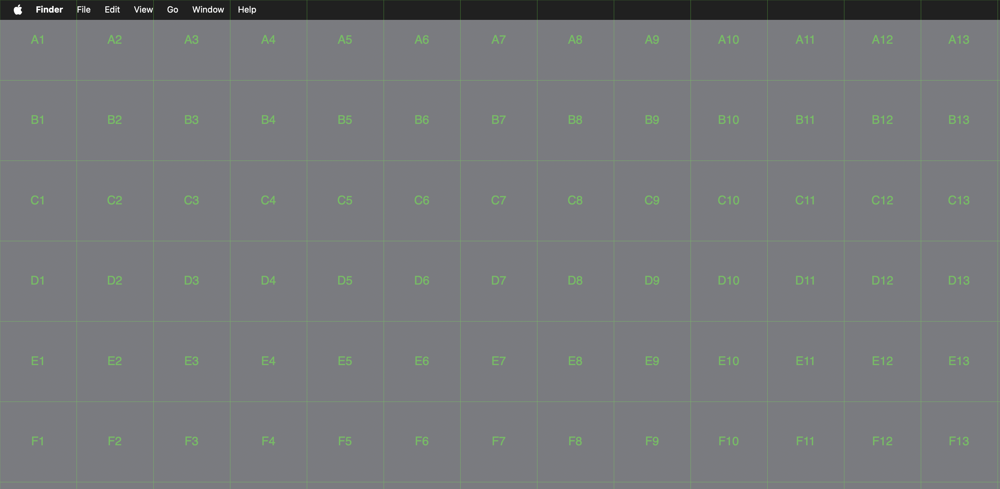
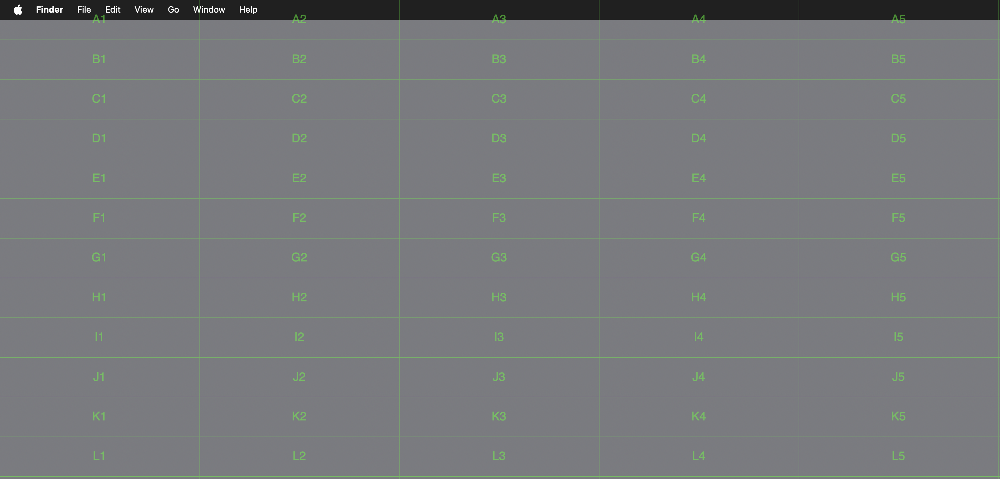

# GridPoint

A macOS menu bar app that displays a transparent grid overlay over the entire screen.
It helps you refer to specific screen locations during video calls (e.g. "around A3").

<p align="center">
  
  
</p>

## Features

- Transparent grid overlay across the whole screen (multi-monitor support)
- Labels using alphabet rows (A, B, C, ...) × numeric columns (1, 2, 3, ...)
- Fully click-through to apps beneath
- Adjust grid size and opacity instantly from the menu bar
- Menu bar only (no Dock icon)

## Requirements

- macOS 13 Ventura or later

## Installation

### Homebrew (recommended)

This repository itself is used as a tap:

```bash
brew tap punkt-tokyo/gridpoint https://github.com/punkt-tokyo/gridpoint
brew install --cask gridpoint
```

To update:

```bash
brew update
brew upgrade --cask gridpoint
```

### Manual installation

1. Download the latest `GridPoint-x.x.x.zip` from [Releases](https://github.com/punkt-tokyo/gridpoint/releases)
2. Unzip and move `GridPoint.app` into `/Applications`
3. On first launch, right-click the app and choose "Open" to bypass the Gatekeeper warning

## Shortcuts

| Action | Shortcut |
|---|---|
| Show / Hide grid | `⌘ + Shift + G` |

Shortcuts can be changed from the Settings window.

## Limitations

- Due to OS restrictions, the grid may not appear over fullscreen apps
- The grid may be captured in screenshots (hide it before taking a shot)
- On first launch, if Gatekeeper blocks the app, right-click and choose "Open" to allow it

## Why is sandboxing disabled?

GridPoint intentionally ships without App Sandbox (`com.apple.security.app-sandbox = false`) because its core features require APIs that the sandbox blocks:

- **Global hotkeys** via Carbon's `RegisterEventHotKey` (e.g. `⌘⇧G` to toggle)
- **Full-screen overlay windows** at `NSWindow.Level.screenSaver` across all displays

All source is MIT-licensed and available in this repository for review.

## License

MIT License. See [LICENSE](LICENSE) for details.

---

## Release procedure (maintainers)

This repository doubles as a Homebrew tap. To publish a new release:

1. Update `MARKETING_VERSION` in `GridPoint.xcodeproj` (e.g. `1.1.0`)
2. Update `version` in `Casks/gridpoint.rb` to match
3. Run `make zip` to produce `GridPoint-<version>.zip` and its SHA256
4. Create a `v<version>` tag on GitHub Releases and upload the zip
5. Update `sha256` in `Casks/gridpoint.rb` with the value printed in step 3
6. Commit and push to `main` (tap users pick up the new version with `brew update`)
